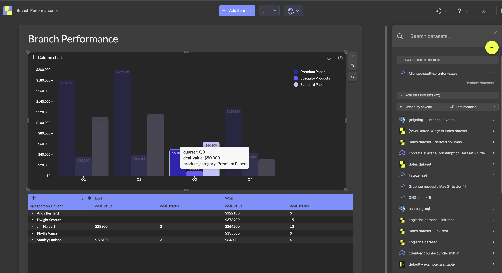
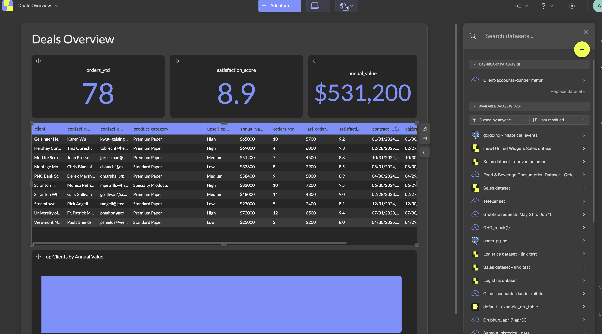
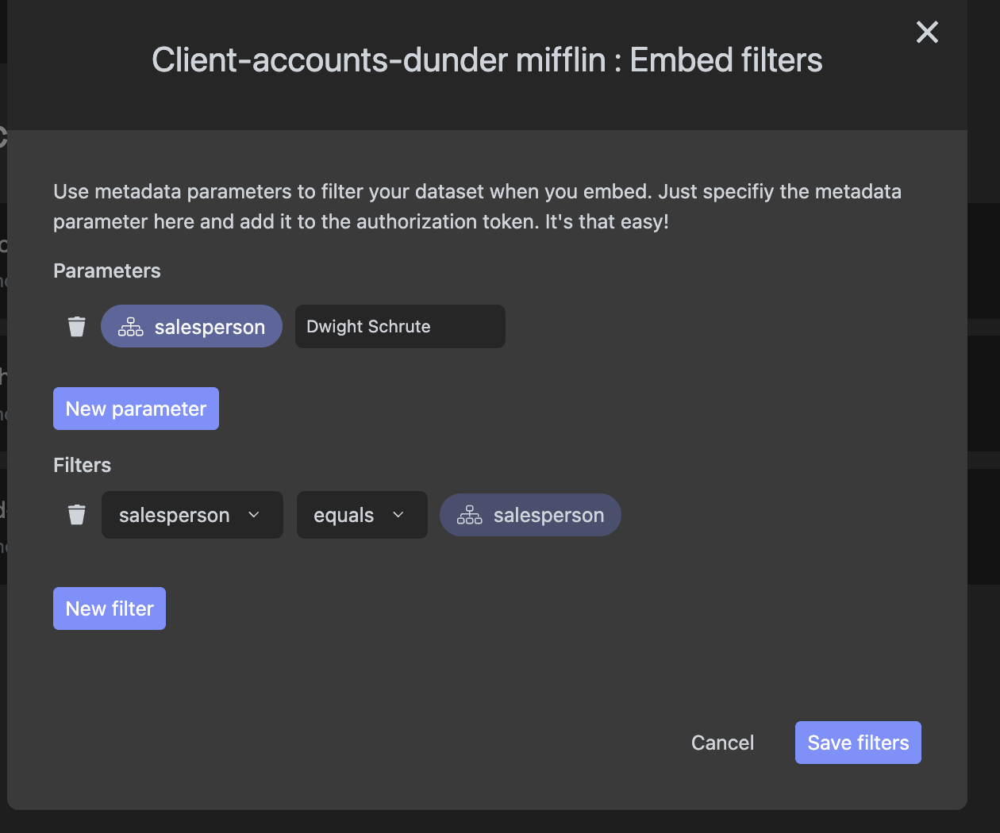
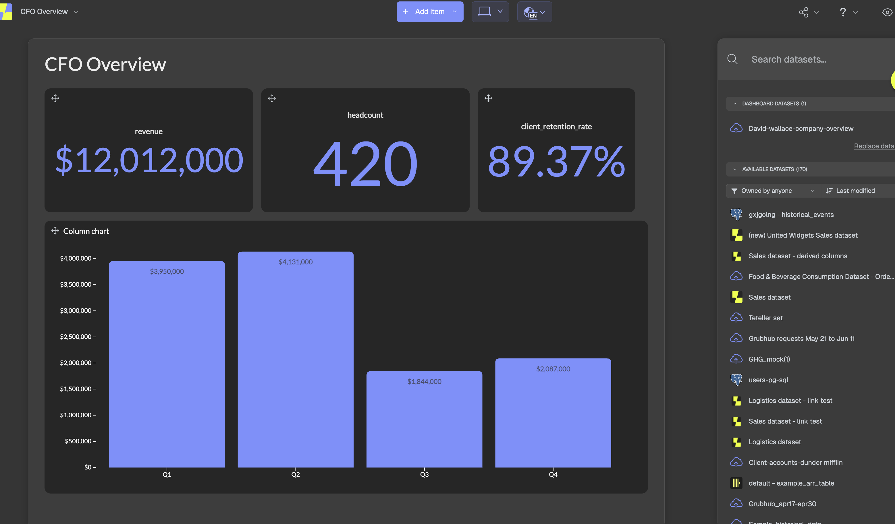
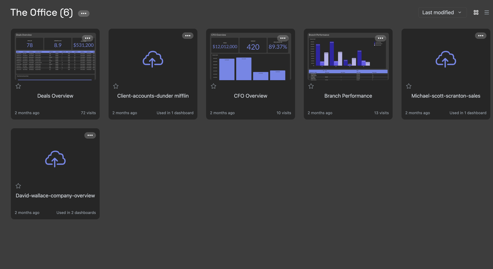

# Luzmo Embedded Analytics — Different Tech Stacks

This repo contains example implementations of [Luzmo](https://www.luzmo.com/) embedded analytics using different tech stacks.

## Implementations

| Folder | Backend | Frontend |
| --- | --- | --- |
| [py-and-react](./py-and-react) | Python (FastAPI) | React (Vite) |
| [py-and-angular](./py-and-angular) | Python (Django) | Angular |
| [py-and-vue](./py-and-vue) | Python (FastAPI) | Vue (Vite) |
| [node-and-react](./node-and-react) | Node.js (Express) | React (Vite) |
| [node-and-angular](./node-and-angular) | Node.js (Express) | Angular |
| [node-and-vue](./node-and-vue) | Node.js (Express) | Vue (Vite) |

More examples are coming in the future with other tech stacks.

## Prerequisites

Before getting started with any of the implementations, you need to set up the datasets and dashboards in your Luzmo account. Every implementation shares the same Luzmo backend, so this only needs to be done once.

> [!NOTE]
> This setup is **optional** — it just reproduces the demo exactly. You are free to bring your own datasets, dashboards, collections, and parameter filters instead. If you do, the one thing you must keep in sync is the **parameter override**: whatever parameter you filter your dataset on must match what the backend sends in `parameter_overrides`. See [Bring your own parameter filters](#bring-your-own-parameter-filters) for the exact files and lines to change.

### 1. Upload the sample datasets

Upload the CSV files in the [datasets](./datasets) folder to Luzmo. The [Local file upload](https://academy.luzmo.com/article/3w4tyd4s) article outlines how to do so.

| Dataset file | Used by |
| --- | --- |
| [michael-scott-scranton-sales.csv](./datasets/michael-scott-scranton-sales.csv) | Branch Performance dashboard |
| [client-accounts.csv](./datasets/client-accounts.csv) | Deals Overview dashboard |
| [david-wallace-company-overview.csv](./datasets/david-wallace-company-overview.csv) | CFO Overview dashboard |

### 2. Create three dashboards

Build the following dashboards in Luzmo. Feel free to set them up however you like with different charts — the screenshots below are just examples.

#### Branch Performance

Uses the **Michael-scott-scranton-sales** dataset.



#### Deals Overview

Uses the **Client-accounts** dataset. This is the most important one, because you need to set up Luzmo [parameter overrides](https://academy.luzmo.com/article/e921u7ua) on it so each embedded user only sees their own client accounts.

Add a `salesperson` metadata parameter to the dataset and a filter where `salesperson` equals that parameter. The backend then passes the signed-in persona's name into `parameter_overrides.salesperson` when creating the embed token, so sales reps are scoped to their own rows.



#### Bring your own parameter filters

If you set up your dataset with a **different** parameter name (e.g. `region`, `tenant_id`, `customer`), update the embed token payload in the backend so the key under `parameter_overrides` matches your parameter, and adjust the value to whatever you want to scope each user to. The relevant location in every backend:

| Implementation | File | What to change |
| --- | --- | --- |
| py-and-react | [py-and-react/backend/main.py](./py-and-react/backend/main.py) (~line 104) | `auth_payload["parameter_overrides"] = { "salesperson": ... }` |
| py-and-vue | [py-and-vue/backend/main.py](./py-and-vue/backend/main.py) (~line 104) | `auth_payload["parameter_overrides"] = { "salesperson": ... }` |
| py-and-angular | [py-and-angular/backend/embed/views.py](./py-and-angular/backend/embed/views.py) (~line 85) | `auth_payload["parameter_overrides"] = { "salesperson": ... }` |
| node-and-react | [node-and-react/backend/server.js](./node-and-react/backend/server.js) (~line 93) | `authPayload.parameter_overrides = { salesperson: ... }` |
| node-and-vue | [node-and-vue/backend/server.js](./node-and-vue/backend/server.js) (~line 93) | `authPayload.parameter_overrides = { salesperson: ... }` |
| node-and-angular | [node-and-angular/backend/server.js](./node-and-angular/backend/server.js) (~line 93) | `authPayload.parameter_overrides = { salesperson: ... }` |

The override is only applied to roles in the `SALES_REPS` set (defined near the top of each of the same files), and the per-persona values come from the `ROLE_PROFILES` map — change these to match your own users and access logic.



#### CFO Overview

Uses the **David-wallace-company-overview** dataset.



### 3. Group everything in a collection

Add all the datasets and dashboards to a single Luzmo collection, as outlined in [Organizing dashboards and datasets with collections](https://academy.luzmo.com/article/mn5a4knx). The backend grants embed access at the collection level, so everything you want to embed must live in this collection.



### 4. Wire up your credentials

Once the datasets, dashboards, and collection exist, copy each backend's `.env.example` to `.env` and fill in your Luzmo API key/token and the collection ID. You will also need to update the dashboard IDs in the frontend to match the dashboards you created (see each implementation's `Dashboard` page/component).

## Quick Start (py-and-react)

### Backend

```bash
cd py-and-react/backend
python -m venv .venv
source .venv/bin/activate
pip install -r requirements.txt
cp .env.example .env   # fill in your Luzmo credentials
uvicorn main:app --reload
```

The API runs on `http://localhost:8000`.

### Frontend

```bash
cd py-and-react/frontend
npm install
npm run dev
```

The app runs on `http://localhost:5173`. API requests are proxied to the backend automatically.

> All Luzmo credentials, dashboard IDs, and server URLs are managed in the backend `.env` — no frontend config needed.

## Quick Start (py-and-angular)

### Backend

```bash
cd py-and-angular/backend
python -m venv .venv
source .venv/bin/activate
pip install -r requirements.txt
cp .env.example .env   # fill in your Luzmo credentials
python manage.py runserver
```

The API runs on `http://localhost:8000`.

### Frontend

```bash
cd py-and-angular/frontend
npm install
ng serve
```

The app runs on `http://localhost:4200`. API requests are proxied to the backend automatically.

> All Luzmo credentials and server URLs are managed in the backend `.env` — no frontend config needed.

## Quick Start (py-and-vue)

### Backend

```bash
cd py-and-vue/backend
python -m venv .venv
source .venv/bin/activate
pip install -r requirements.txt
cp .env.example .env   # fill in your Luzmo credentials
uvicorn main:app --reload
```

The API runs on `http://localhost:8000`.

### Frontend

```bash
cd py-and-vue/frontend
npm install
npm run dev
```

The app runs on `http://localhost:5173`. API requests are proxied to the backend automatically.

> All Luzmo credentials, dashboard IDs, and server URLs are managed in the backend `.env` — no frontend config needed.

## Quick Start (node-and-react)

### Backend

```bash
cd node-and-react/backend
npm install
cp .env.example .env   # fill in your Luzmo credentials
node server.js
```

The API runs on `http://localhost:8000`.

### Frontend

```bash
cd node-and-react/frontend
npm install
npm run dev
```

The app runs on `http://localhost:5173`. API requests are proxied to the backend automatically.

> All Luzmo credentials and server URLs are managed in the backend `.env` — no frontend config needed.

## Quick Start (node-and-angular)

### Backend

```bash
cd node-and-angular/backend
npm install
cp .env.example .env   # fill in your Luzmo credentials
node server.js
```

The API runs on `http://localhost:8000`.

### Frontend

```bash
cd node-and-angular/frontend
npm install
ng serve
```

The app runs on `http://localhost:4200`. API requests are proxied to the backend automatically.

> All Luzmo credentials and server URLs are managed in the backend `.env` — no frontend config needed.

## Quick Start (node-and-vue)

### Backend

```bash
cd node-and-vue/backend
npm install
cp .env.example .env   # fill in your Luzmo credentials
node server.js
```

The API runs on `http://localhost:8000`.

### Frontend

```bash
cd node-and-vue/frontend
npm install
npm run dev
```

The app runs on `http://localhost:5173`. API requests are proxied to the backend automatically.

> All Luzmo credentials and server URLs are managed in the backend `.env` — no frontend config needed.
